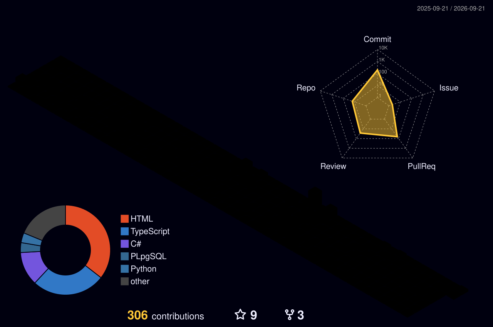

# ~~鱿鱼没有骨~~

[Blog](http://konpoku.github.io/) · [Email](mailto:bsy998244353@gmail.com)

Yujin Zhao / 赵禹晋

---

你好，我是 **赵禹晋**，来自贵州贵阳，高中毕业于贵阳市第一中学。目前是清华大学电子工程系大三本科生。

- 目前在 [ByteDance Seed Infra](https://seed.bytedance.com/zh/) 实习
- 正在学习 AI Infra。
- 现任清华电子系学生科协（ [EESAST](https://github.com/eesast/) ）副主席
- 个人博客：[konpoku.github.io](http://konpoku.github.io/)
- 如果您对我感兴趣，可以邮件联系我

---

Hi there! I'm **Yujin Zhao**, a 3rd-year undergraduate student in Electronic Engineering at Tsinghua University. I come from Guiyang, Guizhou, and graduated from Guiyang No.1 High School.

- Currently working with [ByteDance Seed Infra](https://seed.bytedance.com/zh/)
- Currently learning AI infrastructure
- Serving as the Vice Chairman of [EESAST](https://github.com/eesast/)
- Personal blog: [konpoku.github.io](http://konpoku.github.io/)
- Opening for opportunities (plz email me)

---

