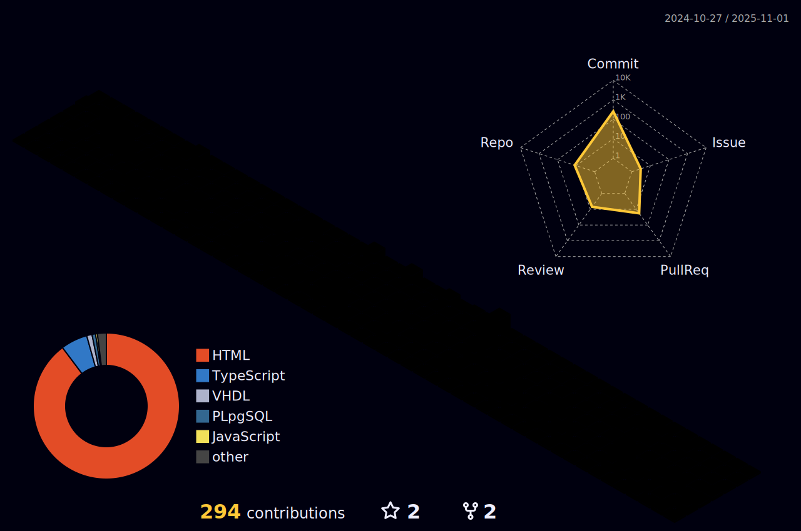

## Swimming in the sea like a fish bone

Hi,there! I'm Jeffery Zhao, a current BEngg (Electronic Engineering) student of Tsinghua University.I'm from Guizhou,Guiyang, and graduated from Guiyang No.1 High School.

你好，我是赵禹晋，贵州贵阳人，高中毕业于贵阳市第一中学，现在是清华大学电子工程系的一名大二本科学生。
这是[我的博客](http://konpoku.github.io/)

- **Languages to Learn**:

    
    
    
    
    

- **Tools**

    
    
    
    

- **Operating System**

    
    
    
  
- **Contact**

    
